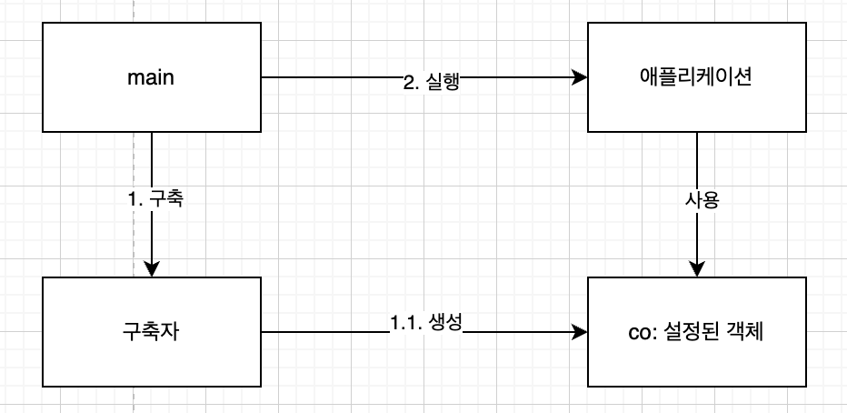
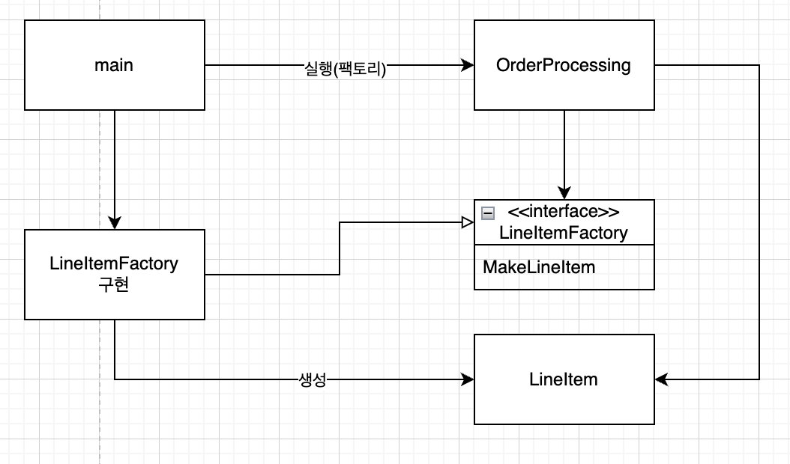
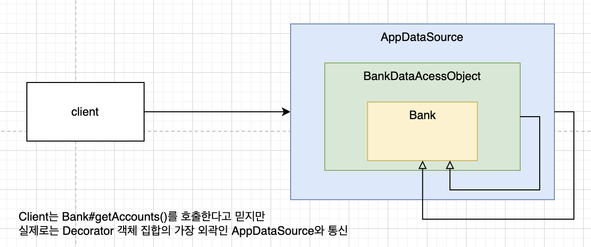

# 11. 시스템
## 도시를 세운다면?(학습목표)
* 시스템 수준에서 꺠끗함을 유지하는 방법
## 시스템 제작과 시스템 사용을 분리하라
* 소프트웨어 시스템은
  * 준비과정(애플리케이션 객체를 제작하고 의존성을 연결하는 준비과정)과
  * 런타임 로직을 분리해야 한다.
* 시작단계 역시 관심사(concern)이다.
  * ex
  ```java
    public Service getService() {
        if (service == null) {
            service = new MyServiceImpl(...);
        }
        return service;
    }
    ```
    * 초기화 지연 or 계산 지연
      * 장점
        * 필요할 때까지 객체를 생성하지 않으므로 불필요한 부하기 생기지 않음
        * 어떤 경우에도 null 포인터를 반환하지 않음
      * 단점
        * getService 메서드가 MyServiceImpl 과 생략한 인수에 명시적으로 의존
        * 런타임 로직에서 MyServiceImpl 객체를 사용하지 않더라도, 의존석을 해결하지 않으면 컴파일이 안됨
        * MyServiceImpl이 무거운 객체라면, 단위테스트에 getService 메서드를 호출하기 전에 적절한 테스트 전용 객체를 할당해야 함
        * 일반 런타임 로직에 객체 생성 로직이 섞여 있어 null 인 경로, null이 아닌 경로 모두 테스트 해야 함
        * MyServiceImpl이 모든 상황에 적합한 객체인지 모름
* 체계적인고 단단한 시스템을 만들기 위애서는
  * 모듈성을 깨서는 절대로 안됨
  * 설정 논리는 일반 실행 논리와 분리해야 모듈성이 강해진다.
  
### Main 분리

* 시스템 생성과 사용을 분리하는 방법
  * 생성과 관련된 코드를 main 으로 옮기고, 나머지 시스템은 모든 객체가 생성되고, 의존성이 연결되었다고 생각하고 사용
### 팩토리

* 객체의 생성시점을 애플리케이션이 결정해야 할 때, 추상 팩토리 패턴을 사용
  * LineItem 을 생성하는 시점은 애플리케이션이 결정하지만, LineItem 을 생성하는 코드는 애플리케이션이 모름
### 의존성 주입
* 사용과 제적을 분리하는 강력한 매커니즘 중 하나: 의존성 주입(Dependency Injection)
* 의존성 주입은 제어 역전(Inversion of Control, IoC)를 의존성 관리에 적용한 매커니즘
* 객체는 객체를 생성할 책임은 지지 않고, 대신에 이 책임을 전담 매커니즘에게 넘겨야만 한다.
  * 주로 main 루틴이나 특수 컨테이너
* 스프링 프레임워크의 DI 컨테이너
  * 초기화 지연도 선택적으로 할 수 있음
## 확장
* 미리 성급하게 판단하여 큰 시스템을 구현하는 것은 지양해야 함
* 오늘 주어진 사용자 스토리에 맞춰 시스템을 구현해야 함
  * 애자일 방식: 반복적이고 점진적
* 테스트 주도 개발, 리팩터링, 깨끗한 코드는 **코드 수준**에서 시스템을 조정하고 확장하기 쉽게 만든다.
  * 시스템 수준에서는? 마찬가지다!
* 소프트웨어 시스템은 관심사르 적절히 분리해 관리한다면, 점진적으로 발전할 수 있다.
* EJB1, EJB2 는 관심사를 적절히 분리하지 못해 유기적인 성장이 어려웠다.

### 횡단(cross-cutting) 관심사
* 관점 지향 프로그래밍(Aspect Oriented Programming, AOP)
  * 횡단 관심사에 대처하여 모듈성을 확보하는 일반적인 방법론
  * Aspect 모듈 구성 개념
    * 특정 괌심사를 지원하려면 시스템에서 특점 지점들이 동작하는 방식을 일관성 있게 바꿔야 한다.
    * 명시는 간결한 선언이나 프로그래밍 메커니즘
* 자바에서 사용하는 관점 혹은 관점과 유사한 매커니즘 세개
  1. 자바 프록시
  2. 순수 자바 AOP 프레임 워크
  3. AspectA
## 자바 프록시
* 단순한 상황에 적합
  * ex) 개별 객체나 클래스에서 메서드 호출을 감싸는 경우
* JDK 에서 제공하는 동적 프록시는 인터페이스만 지원, 클래스 프록시를 사용하려면 바이트 코드 처리 라이브러리가 필요
* 단점
  * 코드가 많고 복잡
  * 시스템 단위로 실행 지점을 명시하는 메커니즘도 제공하지 않음(AOP 핵심)
## 순수 자바 AOP 프레임워크
* 순수 자바 관점을 구현하는 여러 자바 프레임 워크들
  * 스프링 AOP, JBoss AOP 등 -> 내부적으로 프록시 사용
* 스프링은 POJO로 비즈니스 논리를 구현
  * 프레임워크에 의존적이지 않아 독립적으로 테스트 할 수 있음
* 횡단 관심사(영속성, 트랜잭션, 보안, 캐시, 장애 조치 등)는 설정 파일이나 API를 이용해 설정
  * 선언적

* 데코레이터 패턴을 이용하여 횡단 관심사 적용
## AspectJ 관점
* 장점: 관심사를 관점으로 분리하는 가장 강력한 도구
* 단점: 새 도구를 사용하고, 새 언어 문법과 사용법을 익혀야 한다.
  * 애너테이션 폼이 단점을 어느 정도 완화
  * 스프링 프레임워크에서도 애너테이션 기반으로 쉽게 사용할 수 있도록 기능 제공
## 테스트 주도 시스템 아키텍처 구축
* 최선의 시스템 구조
  * 각기 POJO 객체로 구현되는 모듈화된 관심사 영역(도메인)으로 구성 된다.
  * 서로 다른 영역은 해당 영역 코드에 최소한의 영향을 미치는 관점이나 유사한 도구를 사용해 통합 됨
    * 이런 구조 역시 테스트 주도 기법 적용 가능
## 의사 결정을 최적화 하라
* 모듈을 나누고 관심사를 분리하면 가장 적합한 상황에가 책임을 맡길 수 있다.
## 명백한 가치가 있을 때 표준을 현명하게 사용하라
## 시스템 도메인 특화 언어가 필요하다
* 도메인 특화 언어(Domain Specific Language, DSL)이 필요
  * 간단한 스크립트 언어나 표준언어로 구현한 API
  * 도메인 개념과 그 개념을 구현한 코드 사이에 존재하는 의사소통 간극을 줄여 준다.
  * 돈메인 전문가가 사용하는 언어로 도메인 논리를 구현하면, 잘못 구현할 가능성이 줄어 든다.
  * 고차원 정책에서 저차원 세부사항까지 모든 추상화 수준과 모든 도메인을 POJO 로 표현할 수 있다.
## 결론
* 깨끗하지 못한 아키텍처(시스템)
  * 도메인 논리를 흐리며
  * 기민성을 떨어뜨림 - 생산성이 낮아져 TDD 가 제공하는 장점이 사라짐
  * 제품 품질 떨어짐 - 버그 쉽게 발생, 스토리 구현하기 어려움
* 모든 추상화 단계에서 의도는 명확히 표현해야 함
  * POJO 작성
  * 관점 혹은 관점과 유사한 매커니즘을 사용해 각 구현 관심사를 분리
* 시스템을 설계하든, 개별 모들을 설계하든
  * 가장 단순한 수단을 사용해야 한다.